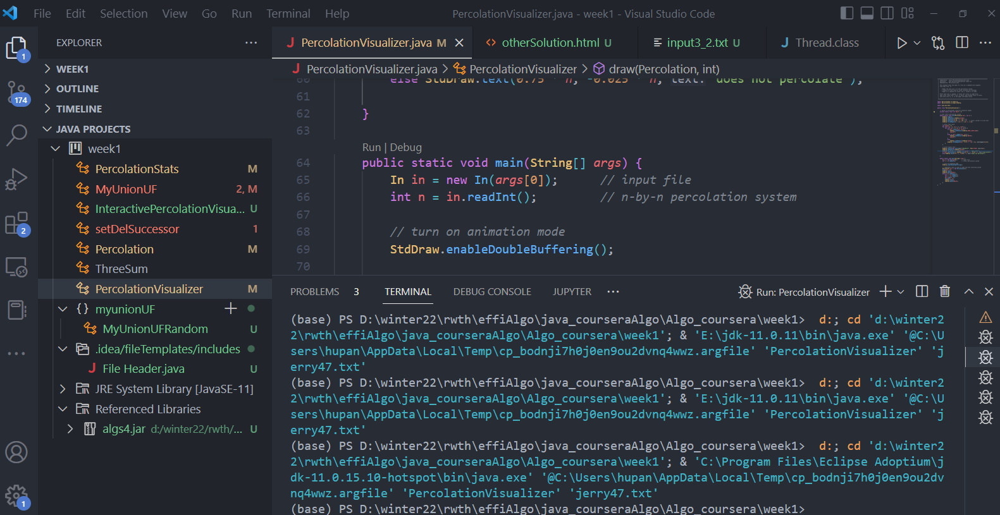

# percolation

* note there is an update on test cases, which is random picking root when doing a 
union operation

```log
Test 17: substitute the WeightedQuickUnionUF implementation with one that
         picks the leader nondeterministically after each call to union();
         call all methods in random order until almost all sites are open
         (with inputs not prone to backwash)
  * n = 3
    - percolates() returns wrong value after 5 sites opened
    - student   percolates() = false
    - reference percolates() = true

    - failed on trial 5 of 40

```

the previous solution goes like this, maintain a n^2 + 1 size array, `connectedToBottom` to indicate if the queried connected component is connect to bottom (to tackle the backwash problem, because if use one virtual top and virtual bottom, there is essentially no difference between all opened slot at the bottom row, but indeed, because there might be some slots that are actually connected to top and some not, so the bottom row need to be able to distinguish with each other, so have to avoid using only one single virtual bottom node). At each new opened set, it will try to connect its neighbor, there are two cases,

1. if the opened node is from bottom row, then set the connected component it belongs to to be connecteToBottom (by inspecting the root)

2. if the opened slot has a nieghbor, whose connected component is connecting to bottom, then set the connected component after union to connect to bottom.

for checking percolation, just need to check if the virtual root node's connected component is connected to bottom. (O(1 + cost for finding root))

The problem with this is that it requires the "relative fix" of the root
killing situation:

* suppose root is already connect to bottom, now a new slot at top row is opened, which is not connect to bottom per se, but the union operation (union this slot to virtual top node) set the root to this new slot.  (note for weightedUF, this will not happen, because it will always set the root to the original one, because the connected component of the root has always larger size than a single new node)

then the connectToBottom for this node is false, and when checking its neighbor, (all are closed) so now the updated root will actually indicate it is not connected to bottom

The solution to this is quite simple, just maintain a flag, when having found out that the virtual top is connected to bottom, just set the flag to be true, and when later open again a new slot at top row, update the root if necessary according to the flag

```java
        if (row == 1) {
            uniUF.union(coord, 0);
            if (percolated) {
                connectedToBottom[uniUF.find(0)] = true;
            }
        }
```        

* guess a theorem:

the first time the connected component where the root is located gets connect to the bottom, `connectToBottom[uniUF.find(0)]` will return the true result

```java
        if (connectedToBottom[uniUF.find(0)]) {
            percolated = true;
        }
```

i.e. the above code will successfully set the flag indicating `percolated`

that is why for testing `percolate()`, only need to return the flag, instead of querying again the root

- moreover, since once percolated, it will remain so, and actually there is no need for checking the root connected to bottom, so we could actually get rid of updating the root when a new top row slot is opened.

```java

        if (row == 1) {
            uniUF.union(coord, 0);
            // if (percolated) { // dont needed!
            //     connectedToBottom[uniUF.find(0)] = true;
            // }
        }
```        

# about vscode configuration

to add jar, just click the plus sign in `Referenced Libraries` and add the `algs4.jar` it will work

example `launch.json` file

```json
        {
            "type": "java",
            "name": "Launch PercolationVisualizer",
            "request": "launch",
            "mainClass": "PercolationVisualizer",
            "projectName": "week1_f051863c",
            "args": [
                // "input3_2.txt"
                "jerry47.txt"
            ]
        }
```

* example configured 

note in the left task bar, where the `algs4.jar` is located, the `Run | Debug` button in the editor
is located and how does the command line look like